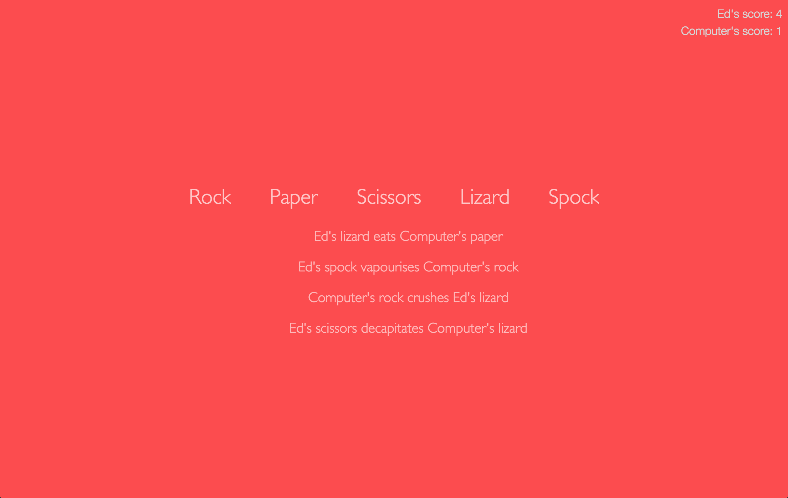

# Rock Paper Scissors Lizard Spock (Javascript)

## Summary

In Week 5 at Makers Academy we expanded on our initial [Rock Paper Scissors game](https://github.com/ejbyne/js-rock-paper-scissors) by creating the more complicated version "Rock Paper Scissors Lizard Spock". This was an opportunity to start producing more complex JavaScript code, again using an OOD approach and with Jasmine as the testing framework.

We also learnt how to use JQuery to create a single-page interactive and animated web application, which was then put on a simple Sinatra server.

The live version of the application can be viewed [here](https://js-rpsls.herokuapp.com).

## Rules

Check here for a summary of the [rules](http://www.samkass.com/theories/RPSSL.html) of the game.

## Technologies used

- Javascript
- Jasmine
- JQuery
- HTML
- CSS
- Sinatra
- Heroku

## Screenshot

## Collaborators

- [Edward Byne](http://www.github.com/ejbyne)
- [Christopher Batts](http://www.github.com/chrisjbatts)
